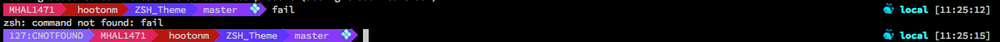

# Keloran Theme

ZSH Theme that includes a few features from other themes

## Requirments
[Nice Exit Code](https://github.com/bric3/nice-exit-code)

## Screenshot

## Features
- Nice Exit Code
- System Name
- Username
- Path
 - Current Path
- Git Branch
- Git Status
 - Staged
   - UnStaged 🔸
   -  Staged 🔹
 - Tracked
   - UnTracked 💠
 - Branch
   - Behind 🔽
   - Ahead 🔼
   - Diverged ↪️
 - Clean ✅
 - Stashed 📦
 - UnMerged 🔴
- Time of last command
- Docker
 - Running
 - Local / Remote
- Jobs
 - Jobs Running ⚡
 - Job Cancelled ❌
- Remote Server Indicator
